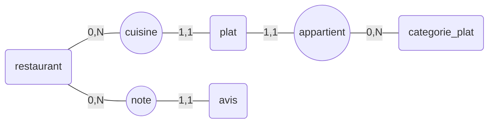

# cuillere-api
"La cuillère", l'application  qui permet de consulter et de noter les restaurants prés de chez soi.

# Schéma de la base

# Lancement de l'application

Il existe 2 profils

## Profil local
L'application utilise une base embarquée avec un petit jeu de donnée. Adapté pour tester une nouvelle fonctionnalitée. 
Le jeu de test est dans le fichier "data.sql"
Il s'agit du profil par défaut.

## Profil docker
L'application utilise une base de données et d'autres outils lancés avec le dockercompose qui se situe dans le répertoire "/docker"

